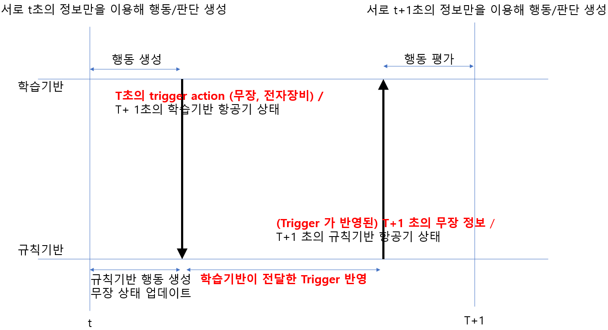
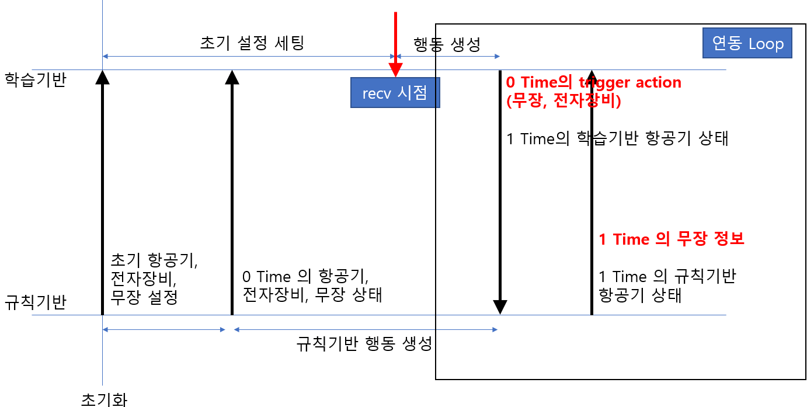
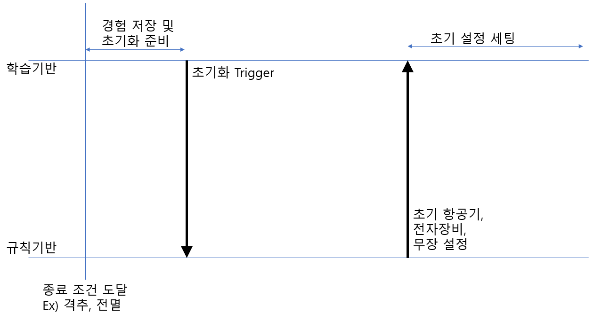

# Air Combat RL Project communicate with ARES 
규칙기반 ACAM 항공기 (from ARES) 를 이용하여 강화학습을 할 수 있는 학습 환경 프로그램이다.
참조 github repo : https://github.com/liuqh16/CloseAirCombat

## Install 

```shell
# create python env
conda create -n jsbsim python=3.8
# install dependency
pip install numpy torch matplotlib gym tensorboard pymap3d jsbsim==1.2.0 geographiclib icecream setproctitle shapely

- Initialize submodules(*JSBSim-Team/jsbsim*): `git submodule init; git submodule update`
```

## Architecture
`envs/JSBSim/envs/env_base.py` 코드 내에 ACAM 과 송수신한 데이터를 parsing 하는 부분이 있음. 해당 부분의 `socket_send_recv` 함수에 ACAM 과 송수신한 데이터를 활용할 수 있다.

## Neural Network Architecture
신경망의 경우 MLP-GRU-MLP 의 가장 간단한 형태로 구성되어 있다.
해당 신경망 정보는 `algorithms/utils/ppo_actor.py` 코드를 확인하면 된다.


## Communication Flow
초기화 시 ACAM 에서 시나리오 설정에 관련된 데이터 파일을 송신하면, 해당 데이터를 이용하여 정보를 수신한다. 수신 된 정보를 이용하여 AI 내 가상 전장환경을 구성하고, 학습을 시작할 수 있도록 전투기, 무장, 지대공 위협의 객체를 생성한다.

만들어진 객체 정보를 이용하여 t초의 상황을 이용해 AI 가상항공기부터 t+1 상황과 신경망 출력 (무장 trigger) 값을 ACAM 에 전달하고, 무장 trigger 정보를 ACAM 이 반영하여 t+1 의 규칙기반 가상항공기 정보와 무장 정보를 AI 에 송신한다.

(1) ARES 와의 통신 구조


(2) 초기화 진행 시 초기화 방법


(3) 종료조건 시 초기화 방법



## Envs
`envs/JSBSim/configs` 안에 각 시나리오 별 임무 계획이 있으며, 시나리오 별 임무를 추가할 수 있다. 현재 있는 임무로는 SAM, 1v1, 2v2 로 구성되어있다.

### SingleCombat
SAM task 와 1v1 공중 교전 임무로 구성되어 있다. AI 내에 무장 라이브러리를 사용하지 않기 때문에, 무장 발사 trigger 를 ACAM 에 전달하는 방식으로 진행된다.


### MultiCombat
2v2 공중 교전 임무로 구성되어 있다. AI 내에 무장 라이브러리를 사용하지 않기 때문에, 무장 발사 trigger 를 ACAM 에 전달하는 방식으로 진행된다.

## Quick Start
### Training

```bash
cd scripts
bash train_*.sh
```

- `--env-name` 가상 전장 환경 정보로 ['SingleCombat', 'MultipleCombat'] 로 사용할 수 있다.
- `--scenario` `envs/JBSim/configs` 에 정의된 yaml 파일로 진행될 수 있다.
- `--algorithm` PPO/MAPPO 를 선택적으로 사용할 수 있다.

추가적인 hyper parameter 는 `config.py` 를 참고하여 수정 및 사용할 수 있다.

### Evaluate and Render
```bash
cd envs/JSBSim/test
python test_*.py
```

저장되는 acmi 파일을 이용하여 [**TacView**](https://www.tacview.net/) 를 이용하여 화면에 결과를 출력한다. 


## Citing
참조 github repo : https://github.com/liuqh16/CloseAirCombat